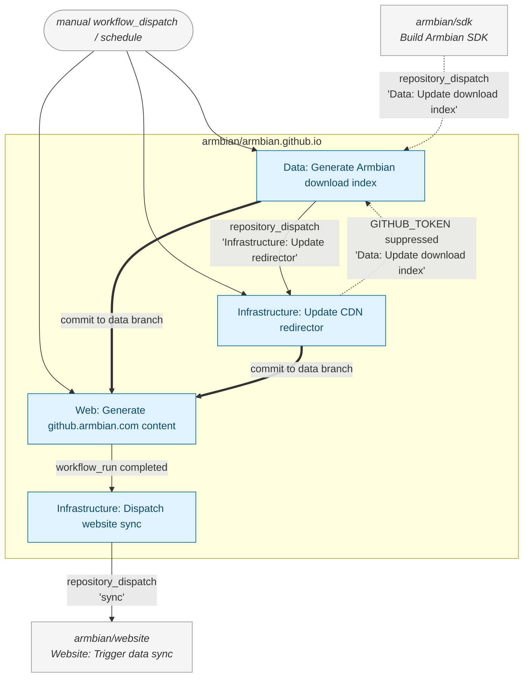

<h2 align="center">
  
    
</h2>

### Purpose of This Repository

This repository acts as a central **automation and orchestration hub** for the Armbian project. It coordinates CI workflows, maintains metadata, syncs external data, and generates machine-readable output to power [armbian.com](https://www.armbian.com), [docs.armbian.com](https://docs.armbian.com), and related services.

It also produces [data exchange files](https://github.armbian.com/) used for automation, reporting, and content delivery across the Armbian infrastructure.

### Workflow Status & Monitoring

**[GitHub actions dashboard](https://actions.armbian.com/?repo=armbian.github.io)**

Monitor all automation workflows with real-time status tracking:

- **Execution history** — Complete log of past workflow runs with timestamps and outcomes
- **Performance metrics** — Runtime duration, resource usage, and success/failure rates
- **Live status** — Current state of running CI/CD pipelines and scheduled tasks
- **Debugging tools** — Detailed logs and error traces for failed workflows

### Download / directory dispatch chain

How a fresh release ripples through the automation. Solid arrows fire; the dotted arrow is intentionally suppressed by GitHub's `GITHUB_TOKEN` same-repo guard (it's the loop-breaker — without it, `redirector ↔ download-index` would cycle forever).

Beyond this chain, several smaller producers (`data-update-image-info`, `data-update-base-files-info`, `data-update-jira-excerpt`, `data-update-partners-data`, `generate-build-lists`, `generate-keyring-data`, `generate-servers-jsons`, `generate-torrent-tracker-lists`, `repository-status`) all dispatch `Web: Directory listing` via `GITHUB_TOKEN`. Those dispatches are suppressed by the same-repo guard — `generate-web-directory` regenerates from the underlying `data` branch push instead.

